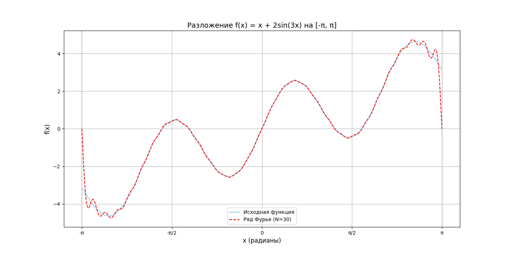

## Math_Solutions
### Задача: Разложить функцию x + 2sin3x в ряд Фурье на [-π; π]

### Ананлитическое решение: 
### 1. Исследовать f(x) на четность/нечетность, делается для упрощения вычислений интегралов коэффициентов Фурье.

Исследование f(x) на четность: 
f(x) - четная if f(-x) = f(x)
f(x) - нечетная if f(-x) = - f(x)

x + 2sin3x = -x + 2sin(-3x) -> f(x) - нечетная

### 2. Вычисление коэффицианта Bn:
                          
Bn = 1/π ∫[-π;π] f(x) * sin(nx) dx = 1/π ∫ [-π;π] (x + 2sin(3x) ) * sin(nx) dx
                                                            
Решение данного интеграла задача трудоемка, тк прдется разбивать его на сумму двух интегралов. 
Затем методом интегрирования по частям считать еще 2 интеграла один из которых ∫cos(3x-nx) - главный жук.
Основная проблема в разложении данной функции, что возникает частный случай при решении интеграла. 

При n = 3: 
∫cos(3x-nx) = 8/3     

Таким образом по формуле ряда Фурье нечетной функции:
       ∞
f(x) = ∑ Bn * sin(nπx/L)
      n=1
Получаем наше разложение:

          ∞
  f(x) =  Σ [(-2 * (-1) ^ n ) / n] * sin(n*x) + (8/3 - (2 * (-1)^4 / 3) * sin(3x)
          n=1

### Решение c помощью Python:
Ряд Фурье для f(x) = x + 2sin(3x) на [-π, π]:

f(x) ≈ 0.000
  + 2.000·sin(1x)
  + -1.000·sin(2x)
  + [2.000·sin(3x)] + 0.667·sin(3x)  # Частный случай n = 3
  + -0.500·sin(4x)
  + 0.400·sin(5x)
  + -0.333·sin(6x)
  + 0.286·sin(7x)
  + -0.250·sin(8x)
  + 0.222·sin(9x)
  + -0.200·sin(10x)
  + 0.182·sin(11x)
  + -0.167·sin(12x)
  + 0.154·sin(13x)
  + -0.143·sin(14x)
  + 0.133·sin(15x)
  + -0.125·sin(16x)
  + 0.118·sin(17x)
  + -0.111·sin(18x)
  + 0.105·sin(19x)
  + -0.100·sin(20x)
  + 0.095·sin(21x)
  + -0.091·sin(22x)
  + 0.087·sin(23x)
  + -0.083·sin(24x)
  + 0.080·sin(25x)
  + -0.077·sin(26x)
  + 0.074·sin(27x)
  + -0.071·sin(28x)
  + 0.069·sin(29x)
  + -0.067·sin(30x)

  
